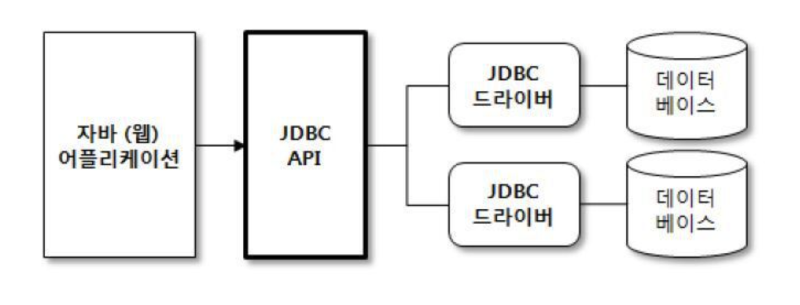

# JDBC

JDBC란 Java Database Connectivity 의 약자로, 자바에서 DB 프로그래밍을 하기 위해서 사용되는 API 입니다. 자바는 DBMS의 종류에 상관없이 하나의 JDBC API를 사용해서 데이터베이스 작업을 처리할 수 있기 때문에, 이를 익혀둔다면 모든 DBMS에 대해서 동일한 방식으로 데이터베이스 작업을 할 수 있게 됩니다.  

JDBC API 사용 어플리케이션의 기본 구성은 다음과 같습니다.



기본 구성에서도 볼 수 있듯이 데이터베이스를 사용할 때에는 데이터베이스의 종류와 상관없이 JDBC API를 이용해서 데이터베이스에 접근하며, 각각의 DBMS는 자신에게 알맞은 JDBC 드라이버를 제공하고 있기 때문에, DBMS에 알맞은 JDBC 드라이버만 존재한다면 어떤 데이터베이스라도 사용할 수 있습니다.   
오라클, MySQL, MS-SQL 등 주요 DBMS에서 알맞은 JDBC 드라이버를 제공하고 있습니다. JDBC 드라이버는 클래스 형태로 존재하며 일반적으로 `Jar` 파일로 제공됩니다.

JDBC 프로그래밍의 전형적인 실행 순서는 다음과 같습니다.

1. JDBC 드라이버 클래스 로드
2. DB 연결을 위한 Connection 객체 생성
3. SQL을 담는 Statement 또는 PreparedStatement 객체 생성
4. 쿼리 실행
5. 쿼리 실행 결과 사용
6. Statement 종료
7. 데이터베이스 커넥션 종료

이를 코드로 표현하면 다음과 같습니다.

```java
// 1. JDBC 드라이버 클래스 로드
Class.forName("come.mysql.cj.jdbc.Driver");

// 2. DB 연결을 위한 Connection 객체 생성
Connection connection = DriverManager.getConnection("jdbc:mysql://localhost/...");

// 3. SQL을 담는 Statement 또는 PreparedStatement 객체 생성
PreparedStatement preparedStatement = connection.prepareStatement(
"INSERT into user(id, name, password) values(?,?,?)"
);
preparedStatement.setLong(1, 1);
preparedStatement.setString(2, "name");
preparedStatement.setString(3, "password");

// 4,5. 쿼리 실행, 쿼리 결과 사용
preparedStatement.executeUpdate();

// 6. Stetement 종료
preparedStatement.close();

// 7. 데이터베이스 커넥션 종료
connection.close();
```