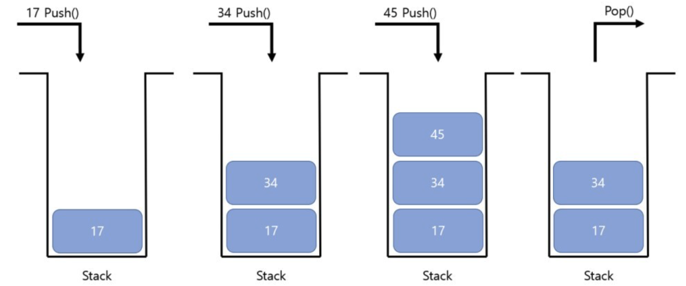

# Java에서 java.util.Stack 이 잘못된 디자인이라고 하는 이유

## Stack이란?

Stack은 LIFO(후입 선출)의 특징을 가진 자료구조입니다.
즉 한 방향에서만 삽입, 삭제가 일어나는 구조이며 중간의 데이터를 삭제하고 넣는 것은 불가능합니다.



## Stack의 시간복잡도

삽입(Push), 삭제(Pop), 읽기(Peak) 는 모두 맨 위의 데이터를 삽입,삭제,읽기 하면 되기 때문에 O(1)입니다.
탐색(Search)만이 맨 위부터 하나씩 찾아야 하기 때문에 O(n)입니다.

## Stack이 잘못 설계된 이유

Stack 클래스의 내부를 직접 확인해보면 다음과 같습니다.

```java
//
// Source code recreated from a .class file by IntelliJ IDEA
// (powered by FernFlower decompiler)
//

package java.util;

public class Stack<E> extends Vector<E> {
    private static final long serialVersionUID = 1224463164541339165L;

    public Stack() {
    }

    public E push(E item) {
        this.addElement(item);
        return item;
    }

    public synchronized E pop() {
        int len = this.size();
        E obj = this.peek();
        this.removeElementAt(len - 1);
        return obj;
    }

    public synchronized E peek() {
        int len = this.size();
        if (len == 0) {
            throw new EmptyStackException();
        } else {
            return this.elementAt(len - 1);
        }
    }

    public boolean empty() {
        return this.size() == 0;
    }

    public synchronized int search(Object o) {
        int i = this.lastIndexOf(o);
        return i >= 0 ? this.size() - i : -1;
    }
}

```

Vector 클래스를 확장하고 있으며 함수에 synchronized를 사용하고 있습니다.
이는 다음과 같은 단점이 생기게 됩니다.

1. synchronized 키워드 사용으로 Thread-safe 합니다.
멀티 스레드 환경이 아닐 때 사용하게되면 lock을 거는 작업으로 인해 많은 오버헤드가 발생합니다.

2. Vector 클래스를 확장함으로 인해서 Stack의 LIFO 구조에 어긋납니다.
Stack은 중간에 삽임, 삭제를 하지 못해야하는데 Vector 클래스를 확장하면 중간에 데이터를 삽입하거나 삭제할 수 있기 때문입니다.

3. Stack은 초기 용량을 설정할 수 있는 생성자가 없기 때문에 데이터의 삽입을 많이하게 되면 배열을 자주 복사하게 됩니다.

## Stack 대신 사용할 수 있는 것

**ArrayDeque** 를 Stack 대신에 사용할 수 있습니다. ArrayDeque는 Thread-Safe 하지 않아서 Stack 클래스보다 빠릅니다.