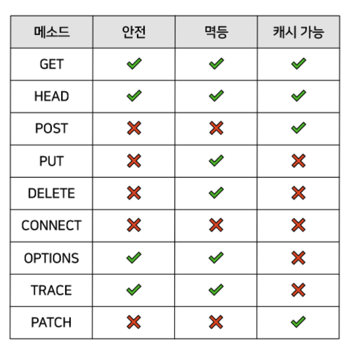

# HTTP 메소드 종류, 특징, 멱등성, 안전한메소드
## ✅ HTTP 메소드
- **GET**

리소스 조회(데이터를 읽거나 검색)에 사용합니다.
서버에 전달하고 싶은 데이터를 url parameter 또는 query string 을 통해 전달합니다.
데이터를 변경하는 연산에는 사용하지 않습니다.

- **POST**

Body를 사용해서 서버로 request 데이터를 전달합니다.
주로 신규 리소스의 등록, 프로세스의 처리 즉 서버에 입력 데이터를 전송하기 위해 사용합니다.

- **PUT**

목적 리소스를 현재 메시지의 값으로 **생성**하거나 만약 존재한다면 기존 리소스를 삭제하고 **덮어쓰기** 합니다.
목적 리소스의 위치를 Client가 모르고 멱등성을 띄지 않는 POST와는 다르게 PUT은 목적 리소스의 위치를 Client가 알며 멱등성을 가지고 있습니다.

- **PATCH**

PUT과 비슷하지만 PUT은 리소스를 전체적으로 변경하는 반면에 PATCH는 리소스를 부분적으로 변경합니다. 그렇기 때문에 PUT과 마찬가지로 리소스의 위치를 클라이언트가 알고 있어야 합니다.
지원하지 않는 경우도 있기 때문에 이런 경우 POST로 대체하여 사용하기도 합니다.

- **DELETE**

리소스의 삭제를 요청하는데 사용됩니다.

- **HEAD**

GET과 동일하지만 메시지 바디를 제외하고 반환합니다.
헤더 정보 이외에는 어떤 데이터도 보내지 않습니다.

웹 서버의 다운 여부 점검이나 웹 서버 정보(버전 등)등을 얻기 위해 사용할 수 있습니다.
리소스를 가져오지 않고도 무언가를 알아낼 수 있을 때 사용할 수 있습니다.

- **OPTIONS**

서버에서 추가 정보를 판별하는데 사용되는 메서드입니다. 그렇기 때문에 CORS 이슈와 자주 엮이곤 합니다.
대상 리소스에 대한 통신을 설정하는데 사용합니다.
웹 서버에게 여러가지 종류의 지원 범위에 대해서 물어봅니다.
서버에게 특정 리소스에 대해 어떤 메서드가 지원되는지 물어볼 수 있습니다.

- **TRACE**

자신의 요청이 서버에 도달했을 때 어떻게 보이는지 알려줍니다.
주로 디버깅용으로 사용됩니다.

- **CONNECT**

요청한 리소스와 양방향 통신을 시작합니다.
터널을 여는 데 사용할 수 있습니다.

## ✅ 멱등성 (GET, HEAD, PUT, DELETE, OPTIONS, TRACE)

멱등성이란 수학에서 사용하는 용어인데, 연산을 여러 번 적용하더라도 결과가 달라지지 않는 성질을 뜻합니다. 프로그래밍에서는 특성 메서드의 요청을 여러번 하더라도 한번 요청했을 때와 결과가 같다면 멱등하다고 합니다.

## ✅ 안전한 메소드 (GET, HEAD, OPTIONS, TRACE)

서버의 상태를 바꾸지 않는(리소스를 수정하지 않는) 메서드를 안전한(Safe) 메소드라고 합니다.

## ✅ 캐시 가능 (GET, HEAD, POST, PATCH)

향후 재사용을 위해 이에 대한 응답을 저장할 수 있음을 나타냅니다.
현재 시점의 응답이나 권한 있는 응답에 의존하지 않는 안전한 메서드는 캐시 가능한 것으로 정의합니다.

## ✅ 표

