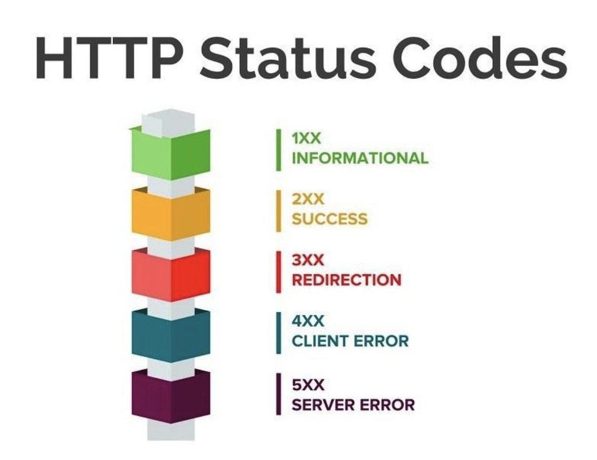

# HTTP Status Codes (401 vs 403, 4xx vs 5xx)

## ✅ 401(Unauthorization) vs 403(Forbidden)

### 401(Unauthorization) → Authorization

401은 클라이언트가 인증되지 않았거나, 유효한 인증 정보가 부족하여 요청이 거부되는 상태입니다.  
(사용자가 로그인되지 않은 경우)

토큰이 잘못된 토큰이거나, expired 될 때 401을 반환합니다.  
결국 **인증(유저가 누구인지 확인하는 절차)**과 관련 있습니다. 

### 403(Forbidden) → Authentication

403은 서버가 해당 요청을 이해했지만, 권한이 없어서 요청이 거부될 때 사용합니다.  
(사용자가 권한이 없는 요청을 하는 경우)  
토큰은 인증가능한 토큰이지만 해당 요청을 보낸 이용자가 기능에 맞는 Scope 밖이거나 사용할 수 없다면 403을 반환합니다.

결국 **인가(유저가 request를 실행할 수 있는 권한이 있는 유형인가를 확인하는 절차)**와 관련있습니다. 

## ✅ 4xx vs 5xx

4xx 에러는 클라이언트 에러이며 5xx는 서버에러입니다.  
보통 4xx 에러는 서버 측에서 예상할 수 있는 에러이기 때문에 클라이언트가 잘못된 요청을 하면 서버측에서 response해줄 수 있습니다.  

반대로 5xx 에러는 서버 에러이기 때문에 예상하지 못한 에러이며 서버측의 잘못입니다.  
5xx 는 의도적으로 client에게 보내거나 보여주면 안됩니다.