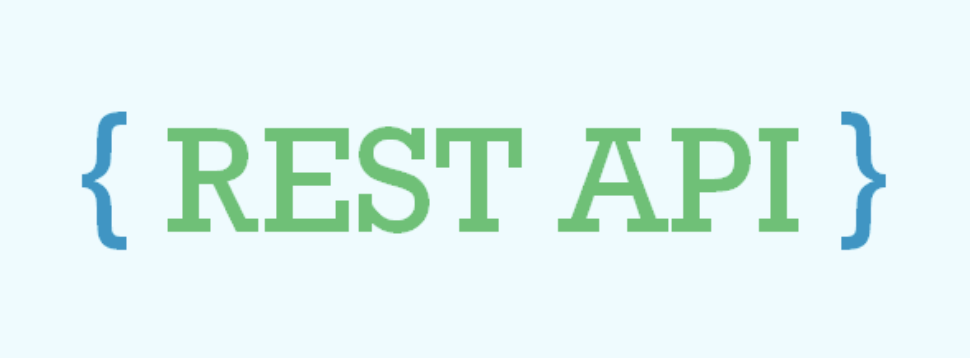

여러 IT회사에서 REST API는 면접 단골 질문이며, 현업에서도 많이 쓰이는 개념입니다.
저 또한 개발자로 일하며 REST API라는 단어를 많이 사용했었습니다.
실제로 이전 회사에서 쓰이는 API들이 RESTful하지 못하다고 생각해서, REST하게 바꿔 보려고 노력한 경험이 있습니다.
하지만 왜 REST API를 사용해야하는가?, REST API란 무엇인가? 라는 동료들의 물음에는 완벽하게 답변하지 못했었습니다.

이 글은 blog 글로 정리해두었습니다.
https://velog.io/@seo_kk/rest