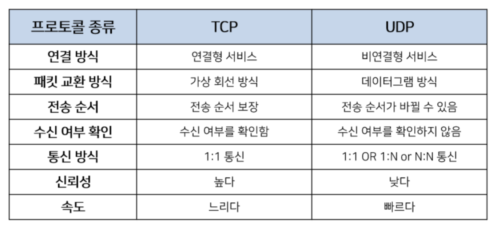

# TCP 특징, UDP의 특징. TCP와 UDP의 차이

네트워크 계층에는 송신자와 수신자를 연결하는 통신서비스를 제공하는 계층으로 **전송 계층**이 존재합니다.  
쉽게 말해서 데이터의 전달을 담당하는데, 이 때 데이터를 보내기 위해 사용하는 프로토콜이 있습니다.  

그 프로토콜이 바로 TCP, UDP 입니다. TCP와 UDP의 차이는 기업 면접에서 네트워크 기초 문제로 자주 등장하곤 합니다.

### TCP(Transmission Control Protocol)

→ 인터넷상에서 데이터를 메세지의 형태로 보내기 위해 IP와 함께 사용하는 프로토콜

일반적으로 TCP와 IP를 함께 사용합니다. IP는 데이터의 배달을 처리하고 TCP는 패킷을 추적 및 관리합니다. TCP는 다음과 같은 특징을 가지고 있습니다.  

- 연결형 서비스로 가상 회선 방식을 제공합니다.
- 3-way-handshaking 과정을 통해 연결하고, 4-way-handshaking 과정을 통해 해제합니다.
- 흐름 제어 및 혼잡 제어
- 높은 신뢰성을 보장합니다.
- UDP보다 속도가 느립니다.
- 전이중(Full-Duplex), 점대점(Point to Point) 방식입니다.

TCP는 연속성보다 신뢰성이 있는 전송이 중요할 때 사용하는 프로토콜로 파일 전송과 같은 경우에 사용됩니다.

### UDP(User Datagram Protocol)

→ 데이터를 데이터그램 단위로 처리하는 프로토콜

데이터그램이란 독립적인 관계를 지니는 패킷을 뜻하는데, UDP는 TCP와 다르게 비연결형 프로토콜입니다. 이렇게 연결을 위해 할당되는 논리적 경로가 없으며, 각각의 패킷은 다른 경로로 전송되고, 독립적인 관계로 데이터를 서로 독립적으로 처리하는 프로토콜을 UDP 라고 합니다.

- 비연결형 서비스로 데이터그램 방식을 제공합니다.
- 정보를 주고 받을 때 정보를 보내거나 받는 신호절차를 거치지 않습니다.
- 신뢰성이 낮습니다.
- TCP보다 속도가 빠릅니다.

UDP는 비연결형 서비스이기 때문에 속도가 빠르며 네트워크 부하가 적다는 장점이 있지만, 신뢰성 있는 데이터의 전송을 보장하지 못합니다. 그렇기 때문에 신뢰성보다 연속성이 중요한 실시간 서비스(streaming)에 자주 사용됩니다.

